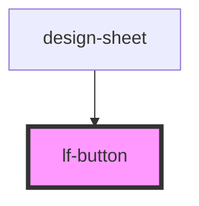

# lf-button

<!-- Auto Generated Below -->

## Properties

| Property   | Attribute  | Description                                                                                                                                                                            | Type                                                                                                   | Default                 |
| ---------- | ---------- | -------------------------------------------------------------------------------------------------------------------------------------------------------------------------------------- | ------------------------------------------------------------------------------------------------------ | ----------------------- |
| `context`  | `context`  | Sets predifined sizes and color schemes based on button type].                                                                                                                         | `ButtonContext.Primary \| ButtonContext.Secondary \| ButtonContext.UI`                                 | `ButtonContext.Primary` |
| `disabled` | `disabled` | If `true`, the user cannot interact with the button.                                                                                                                                   | `boolean`                                                                                              | `false`                 |
| `href`     | `href`     | Contains a URL or a URL fragment that the hyperlink points to. If this property is set, an anchor tag will be rendered.                                                                | `string`                                                                                               | `undefined`             |
| `rel`      | `rel`      | Specifies the relationship of the target object to the link object. The value is a space-separated list of [link types](https://developer.mozilla.org/en-US/docs/Web/HTML/Link_types). | `string`                                                                                               | `undefined`             |
| `size`     | `size`     | Button Size                                                                                                                                                                            | `ButtonSize.Large \| ButtonSize.Regular \| ButtonSize.Small \| ButtonSize.XLarge \| ButtonSize.XSmall` | `ButtonSize.Regular`    |
| `target`   | `target`   | Specifies where to display the linked URL. Only applies when an `href` is provided. Special keywords: `"_blank"`, `"_self"`, `"_parent"`, `"_top"`.                                    | `string`                                                                                               | `undefined`             |
| `type`     | `type`     |                                                                                                                                                                                        | `"button" \| "reset" \| "submit"`                                                                      | `"button"`              |

## Events

| Event     | Description                          | Type               |
| --------- | ------------------------------------ | ------------------ |
| `lfBlur`  | Emitted when the button loses focus. | `CustomEvent<any>` |
| `lfFocus` | Emitted when the button has focus.   | `CustomEvent<any>` |

## Slots

| Slot          | Description                                                                       |
| ------------- | --------------------------------------------------------------------------------- |
|               | Content is placed between the named slots if provided without a slot.             |
| `"end"`       | Content is placed to the right of the button text in LTR, and to the left in RTL. |
| `"icon-only"` | Should be used on an icon in a button that has no text.                           |
| `"start"`     | Content is placed to the left of the button text in LTR, and to the right in RTL. |

## Shadow Parts

| Part       | Description                                                             |
| ---------- | ----------------------------------------------------------------------- |
| `"native"` | The native HTML button or anchor element that wraps all child elements. |

## Dependencies

### Used by

 - [design-sheet](../design-sheet)

### Graph

----------------------------------------------

*Built with [StencilJS](https://stenciljs.com/)*
