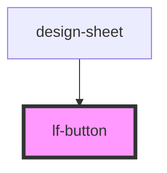

# lf-button

<!-- Auto Generated Below -->

## Properties

| Property   | Attribute  | Description                                                                                                                                                                            | Type                                                        | Default     |
| ---------- | ---------- | -------------------------------------------------------------------------------------------------------------------------------------------------------------------------------------- | ----------------------------------------------------------- | ----------- |
| `context`  | `context`  | Sets predefined sizes and color schemes based on button type.                                                                                                                          | `"primary" \| "secondary" \| "ui"`                          | `"primary"` |
| `disabled` | `disabled` | If `true`, the user cannot interact with the button.                                                                                                                                   | `boolean`                                                   | `false`     |
| `expand`   | `expand`   | Set to `"block"` for a full-width button or to `"full"` for a full-width button without left and right borders.                                                                        | `"block" \| "full"`                                         | `undefined` |
| `href`     | `href`     | Contains a URL or a URL fragment that the hyperlink points to. If this property is set, an anchor tag will be rendered.                                                                | `string`                                                    | `undefined` |
| `rel`      | `rel`      | Specifies the relationship of the target object to the link object. The value is a space-separated list of [link types](https://developer.mozilla.org/en-US/docs/Web/HTML/Link_types). | `string`                                                    | `undefined` |
| `size`     | `size`     | Button Size: "x-large" \| "large" \| "regular" \| "small" \| "x-small"                                                                                                                 | `"large" \| "regular" \| "small" \| "x-large" \| "x-small"` | `"regular"` |
| `target`   | `target`   | Specifies where to display the linked URL. Only applies when an `href` is provided. Special keywords: `"_blank"`, `"_self"`, `"_parent"`, `"_top"`.                                    | `string`                                                    | `undefined` |
| `type`     | `type`     | The type of the button.                                                                                                                                                                | `"button" \| "reset" \| "submit"`                           | `"button"`  |

## Events

| Event     | Description                          | Type                |
| --------- | ------------------------------------ | ------------------- |
| `lfBLur`  | Emitted when the button is focused.  | `CustomEvent<void>` |
| `lfFocus` | Emitted when the button loses focus. | `CustomEvent<void>` |

## Slots

| Slot      | Description                                                           |
| --------- | --------------------------------------------------------------------- |
|           | Content is placed between the named slots if provided without a slot. |
| `"end"`   | Content is placed to the right of the button text.                    |
| `"start"` | Content is placed to the left of the button text.                     |

## Shadow Parts

| Part       | Description                                                             |
| ---------- | ----------------------------------------------------------------------- |
| `"native"` | The native HTML button or anchor element that wraps all child elements. |

## Dependencies

### Used by

 - [design-sheet](../design-sheet)

### Graph

----------------------------------------------

*Built with [StencilJS](https://stenciljs.com/)*
