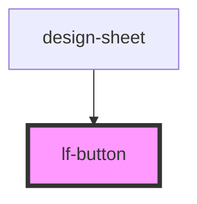

# lf-button


<!-- Auto Generated Below -->


## Usage

### Javascript

```html

<!-- Default  -->
<lf-button></lf-button>

<!-- Anchor -->
<lf-button href="#" rel="nofollow" target="_blank"></lf-button>

<!-- Sizes -->
<lf-button size="x-large">X Large</lf-button>
<lf-button size="large">Large</lf-button>
<lf-button size="regular">Default</lf-button>
<lf-button size="small">Small</lf-button>
<lf-button size="x-small">X Small</lf-button>

<!-- Contexts -->
<lf-button context="primary">Primary</lf-button>
<lf-button context="secondary">Secondary</lf-button>

<!-- Disabled -->
<lf-button disabled>Disabled</lf-button>
<lf-button disabled={true}>Disabled</lf-button>

<!-- Type -->
<lf-button type="submit">Submit</lf-button>
<lf-button type="button">Default</lf-button>
<lf-button type="reset">Reset</lf-button>

<!-- Icons -->
<lf-button>
  
  Left Icon
</lf-button>

<lf-button>
  Right Icon
    
</lf-button>
```


## Properties

| Property   | Attribute  | Description                                                                                                                                                                            | Type                                                        | Default     |
| ---------- | ---------- | -------------------------------------------------------------------------------------------------------------------------------------------------------------------------------------- | ----------------------------------------------------------- | ----------- |
| `context`  | `context`  | Sets predefined sizes and color schemes based on button type.                                                                                                                          | `"destructive" \| "primary" \| "secondary"`                 | `"primary"` |
| `disabled` | `disabled` | If `true`, the user cannot interact with the button.                                                                                                                                   | `boolean`                                                   | `false`     |
| `expand`   | `expand`   | Set to `"block"` for a full-width button or to `"full"` for a full-width button without left and right borders.                                                                        | `"block" \| "full"`                                         | `undefined` |
| `href`     | `href`     | Contains a URL or a URL fragment that the hyperlink points to. If this property is set, an anchor tag will be rendered.                                                                | `string`                                                    | `undefined` |
| `rel`      | `rel`      | Specifies the relationship of the target object to the link object. The value is a space-separated list of [link types](https://developer.mozilla.org/en-US/docs/Web/HTML/Link_types). | `string`                                                    | `undefined` |
| `shape`    | `shape`    | The button shape.                                                                                                                                                                      | `"round"`                                                   | `undefined` |
| `size`     | `size`     | Button Size: "x-large" \| "large" \| "regular" \| "small" \| "x-small" \| undefined                                                                                                    | `"large" \| "regular" \| "small" \| "x-large" \| "x-small"` | `"regular"` |
| `target`   | `target`   | Specifies where to display the linked URL. Only applies when an `href` is provided. Special keywords: `"_blank"`, `"_self"`, `"_parent"`, `"_top"`.                                    | `string`                                                    | `undefined` |
| `type`     | `type`     | The type of the button.                                                                                                                                                                | `"button" \| "reset" \| "submit"`                           | `"button"`  |


## Events

| Event     | Description                          | Type                |
| --------- | ------------------------------------ | ------------------- |
| `lfBlur`  | Emitted when the button is blurred.  | `CustomEvent<void>` |
| `lfFocus` | Emitted when the button loses focus. | `CustomEvent<void>` |


## Slots

| Slot      | Description                                                           |
| --------- | --------------------------------------------------------------------- |
|           | Content is placed between the named slots if provided without a slot. |
| `"end"`   | Content is placed to the right of the button text.                    |
| `"start"` | Content is placed to the left of the button text.                     |


## Shadow Parts

| Part       | Description                                                             |
| ---------- | ----------------------------------------------------------------------- |
| `"native"` | The native HTML button or anchor element that wraps all child elements. |


## CSS Custom Properties

| Name                          | Description                                                    |
| ----------------------------- | -------------------------------------------------------------- |
| `--background`                | Background of the button                                       |
| `--background-active`         | Background of the button when pressed                          |
| `--background-active-opacity` | Opacity of the button background when pressed                  |
| `--background-focus`          | Background of the button when focused with the tab key         |
| `--background-focus-opacity`  | Opacity of the button background when focused with the tab key |
| `--background-hover`          | Background of the button on hover                              |
| `--background-hover-opacity`  | Opacity of the background of the button on hover               |
| `--border-radius`             | Border radius size                                             |
| `--border-width`              | Width of border                                                |
| `--font-family`               | Font family of button                                          |


## Dependencies

### Used by

 - [design-sheet](../design-sheet)

### Graph


----------------------------------------------

*Built with [StencilJS](https://stenciljs.com/)*
