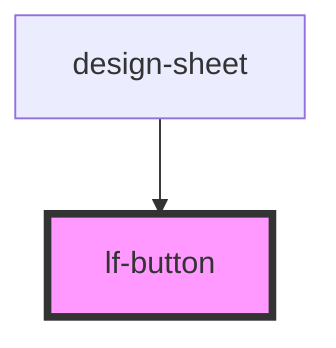

# lf-button

<!-- Auto Generated Below -->

## Properties

| Property   | Attribute  | Description | Type                                                                                                   | Default              |
| ---------- | ---------- | ----------- | ------------------------------------------------------------------------------------------------------ | -------------------- |
| `disabled` | `disabled` |             | `boolean`                                                                                              | `false`              |
| `size`     | `size`     | Button Size | `ButtonSize.Large \| ButtonSize.Regular \| ButtonSize.Small \| ButtonSize.XLarge \| ButtonSize.XSmall` | `ButtonSize.Regular` |
| `type`     | `type`     |             | `ButtonType.Primary \| ButtonType.Secondary \| ButtonType.UI`                                          | `ButtonType.Primary` |

## Dependencies

### Used by

 - [design-sheet](../design-sheet)

### Graph

----------------------------------------------

*Built with [StencilJS](https://stenciljs.com/)*
