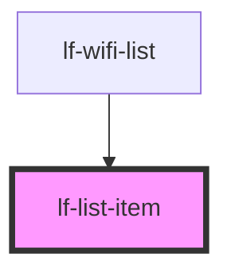

# lf-list-item

Items are elements that can contain text, icons, avatars, images, inputs, and any other native or custom elements. Generally they are placed in a list with other items.

## Clickable Items

An item is considered "clickable" if it has an `href` or `button` property set.

## Item Placement

Item uses named [slots](https://developer.mozilla.org/en-US/docs/Web/HTML/Element/slot) in order to position content. This logic makes it possible to write a complex item with simple, understandable markup without having to worry about styling and positioning the elements.

The below chart details the item slots and where it will place the element inside of the item:

| Slot    | Description                                                                 |
|---------|-----------------------------------------------------------------------------|
| `start` | Placed to the left of all other content.                                    |
| `end`   | Placed to the right of all other content.                                   |
| none    | Placed inside of the input wrapper.                                         |

<!-- Auto Generated Below -->


## Usage

### Javascript

```html
<!-- Default List Item -->
<lf-list-item>Item Content</lf-list-item>

<!-- List Item as Button -->
<lf-list-item button onclick="buttonClick()"> Button Content </lf-list-item>

<!-- List Item as Anchor -->
<lf-list-item href="https://www.lightform.com" rel="nofollow" target="_self">
  Anchor Item
</lf-list-item>

<!-- Disabled -->
<lf-list-item disabled></lf-list-item>

<!-- Active -->
<lf-list-item active></lf-list-item>

<!-- Icons -->
<lf-list-item>
  
  <div>Icon Left</div>
</lf-list-item>

<lf-list-item>
  <div>Icon Right</div>
  
</lf-list-item>
```

### List Items

```html
<lf-list>
  <lf-list-item> Item </lf-list-item>
  <lf-list-item>
    This is a bunch of text that should cause the text to wrap down around to
    the next line
  </lf-list-item>
</lf-list>
```

### Buttons in Items

```html
<lf-item>
  <lf-button slot="start"> Start </lf-button>
  <lf-label>Button Start/End</lf-label>
  <lf-button slot="end"> End </lf-button>
</lf-item>

<lf-item>
  <lf-button slot="start">
    Start Icon
    
  </lf-button>
  <lf-label>Buttons with Icons</lf-label>
  <lf-button slot="end">
    
    End Icon
  </lf-button>
</lf-item>
```

### Item Inputs

```html
<lf-item>
  <lf-label position="floating">Floating Input</lf-label>
  <lf-text-input></lf-text-input>
</lf-item>

<lf-item>
  <lf-label>Checkbox</lf-label>
  <lf-checkbox slot="start"></lf-checkbox>
</lf-item>
```

### List Item Styles

```scss
lf-list-item {
  --background: #{$color-brand-lf-gray-dark};
  --background-active: #{$color-brand-lf-blue-light};
  --background-active-opacity: 1;
  --background-focus: #{$color-brand-lf-gray-dark};
  --background-focus-opacity: 1;
  --background-hover: #{$color-brand-lf-gray-dark};
  --background-hover-opacity: 1;

  --border-radius: 4px;
  --border-width: 2px;
  --border-style: solid;
  --border-color: #FFFFFF;
}
```


## Properties

| Property   | Attribute  | Description                                                                                                                                                                            | Type                              | Default     |
| ---------- | ---------- | -------------------------------------------------------------------------------------------------------------------------------------------------------------------------------------- | --------------------------------- | ----------- |
| `active`   | `active`   | Sets whether the element should be considered active                                                                                                                                   | `boolean`                         | `false`     |
| `button`   | `button`   | If `true`, a button tag will be rendered and the item will be clickable.                                                                                                               | `boolean`                         | `false`     |
| `disabled` | `disabled` | If `true`, the user cannot interact with the item.                                                                                                                                     | `boolean`                         | `false`     |
| `href`     | `href`     | Contains a URL or a URL fragment that the hyperlink points to. If this property is set, an anchor tag will be rendered.                                                                | `string`                          | `undefined` |
| `rel`      | `rel`      | Specifies the relationship of the target object to the link object. The value is a space-separated list of [link types](https://developer.mozilla.org/en-US/docs/Web/HTML/Link_types). | `string`                          | `undefined` |
| `target`   | `target`   | Specifies where to display the linked URL. Only applies when an `href` is provided. Special keywords: `"_blank"`, `"_self"`, `"_parent"`, `"_top"`.                                    | `string`                          | `undefined` |
| `type`     | `type`     | The type of the button. Only used when an `onclick` or `button` property is present.                                                                                                   | `"button" \| "reset" \| "submit"` | `"button"`  |


## Slots

| Slot      | Description                                                           |
| --------- | --------------------------------------------------------------------- |
|           | Content is placed between the named slots if provided without a slot. |
| `"end"`   | Content is placed to the right of the item text.                      |
| `"start"` | Content is placed to the left of the item text.                       |


## CSS Custom Properties

| Name                          | Description                                                  |
| ----------------------------- | ------------------------------------------------------------ |
| `--background`                | Background of the item                                       |
| `--background-active`         | Background of the item when pressed                          |
| `--background-active-opacity` | Opacity of the item background when pressed                  |
| `--background-focus`          | Background of the item when focused with the tab key         |
| `--background-focus-opacity`  | Opacity of the item background when focused with the tab key |
| `--background-hover`          | Background of the item on hover                              |
| `--background-hover-opacity`  | Opacity of the background of the item on hover               |
| `--border-color`              | Color of the item border                                     |
| `--border-color-active`       | Border of the item when pressed                              |
| `--border-color-focus`        | Border of the item when focused with the tab key             |
| `--border-color-hover`        | Border of the item on hover                                  |
| `--border-radius`             | Radius of the item border                                    |
| `--border-style`              | Style of the item border                                     |
| `--border-width`              | Width of the item border                                     |
| `--color`                     | Color of the item                                            |
| `--color-active`              | Color of the item when pressed                               |
| `--color-focused`             | Color of the item when focused with the tab key              |
| `--color-hover`               | Color of the item on hover                                   |
| `--min-height`                | Minimum height of the item                                   |
| `--outer-padding-bottom`      | Bottom padding of the item outer                             |
| `--outer-padding-left`        | Left padding of the item outer                               |
| `--outer-padding-right`       | Right padding of the item outer                              |
| `--outer-padding-top`         | Top padding of the item outer                                |
| `--padding-bottom`            | Bottom padding of the item                                   |
| `--padding-left`              | Left padding of the item                                     |
| `--padding-right`             | Right padding of the item                                    |
| `--padding-top`               | Top padding of the item                                      |


## Dependencies

### Used by

 - [lf-wifi-list](../lf-wifi-list)

### Graph


----------------------------------------------

*Built with [StencilJS](https://stenciljs.com/)*
