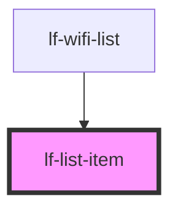

# lf-list-item

<!-- Auto Generated Below -->

## Properties

| Property   | Attribute  | Description | Type      | Default |
| ---------- | ---------- | ----------- | --------- | ------- |
| `dark`     | `dark`     |             | `boolean` | `false` |
| `dense`    | `dense`    |             | `boolean` | `false` |
| `disabled` | `disabled` |             | `boolean` | `false` |
| `light`    | `light`    |             | `boolean` | `false` |
| `outlined` | `outlined` |             | `boolean` | `false` |

## Dependencies

### Used by

 - [lf-wifi-list](../lf-wifi-list)

### Graph

----------------------------------------------

*Built with [StencilJS](https://stenciljs.com/)*
