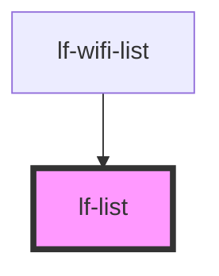

# lf-list-item


<!-- Auto Generated Below -->


## Usage

### Javascript

```html
<!-- Default -->
<lf-list></lf-list>

<!-- Disabled -->
<lf-list disabled></lf-list>

<!-- List Items -->
<lf-list>
  <lf-list-item>Item 1</lf-list-item>
  <lf-list-item>Item 2</lf-list-item>
  <lf-list-item>Item 3</lf-list-item>
</lf-list>

<!-- List with Subheader -->
<lf-list>
  <lf-subheader>Subheader Text</lf-subheader>
  <lf-list-item>Item 1</lf-list-item>
  <lf-list-item>Item 2</lf-list-item>
  <lf-list-item>Item 3</lf-list-item>
</lf-list>
```

### List Styles

```scss
lf-list {
  --height: initial;
  --min-height: 3rem;
  --max-height: initial;

  --width: initial;
  --min-width: 3rem;
  --max-width: initial;

  --background: initial;

  --border-radius: 0;
  --border-width: 0;
  --border-style: solid;
  --border-color: transparent;
}

lf-list.my-class {
    --border-color: red;
}
```


## Properties

| Property   | Attribute  | Description                                                      | Type      | Default |
| ---------- | ---------- | ---------------------------------------------------------------- | --------- | ------- |
| `disabled` | `disabled` | If `true`, the user cannot interact with the list.               | `boolean` | `false` |
| `striped`  | `striped`  | Makes every other line in the list a different background collor | `boolean` | `false` |


## Slots

| Slot | Description                                         |
| ---- | --------------------------------------------------- |
|      | Content is placed inside the native element wrapper |


## Shadow Parts

| Part       | Description                                                |
| ---------- | ---------------------------------------------------------- |
| `"native"` | The native HTML div element that wraps all child elements. |


## CSS Custom Properties

| Name                          | Description                                                                                    |
| ----------------------------- | ---------------------------------------------------------------------------------------------- |
| `--background`                | Background of the list container                                                               |
| `--border-color`              | Color of the list container border                                                             |
| `--border-radius`             | Radius of list container border                                                                |
| `--border-style`              | Style of the list container border                                                             |
| `--border-width`              | Width of the list container border                                                             |
| `--height`                    | Height of the list container                                                                   |
| `--list-item-background-even` | Sets the background color of even lf-list-items if LfList property `striped` is set to `true`; |
| `--list-item-background-odd`  | Sets the background color of odd lf-list-items if LfList property `striped` is set to `true`;  |
| `--max-height`                | Maximum height of the list container                                                           |
| `--max-width`                 | Maximum width of the list container                                                            |
| `--min-height`                | Minimum height of the list container                                                           |
| `--min-width`                 | Minimum width of the list container                                                            |
| `--width`                     | Width of the list container                                                                    |


## Dependencies

### Used by

 - [lf-wifi-list](../lf-wifi-list)

### Graph


----------------------------------------------

*Built with [StencilJS](https://stenciljs.com/)*
