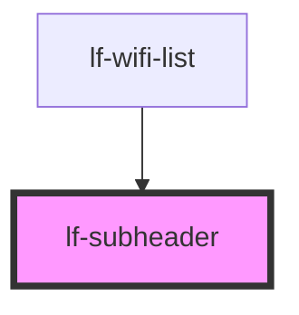

# lf-subheader

<!-- Auto Generated Below -->

## Properties

| Property | Attribute | Description | Type      | Default |
| -------- | --------- | ----------- | --------- | ------- |
| `dark`   | `dark`    |             | `boolean` | `false` |
| `inset`  | `inset`   |             | `boolean` | `false` |
| `light`  | `light`   |             | `boolean` | `false` |

## Dependencies

### Used by

 - [lf-wifi-list](../lf-wifi-list)

### Graph

----------------------------------------------

*Built with [StencilJS](https://stenciljs.com/)*
