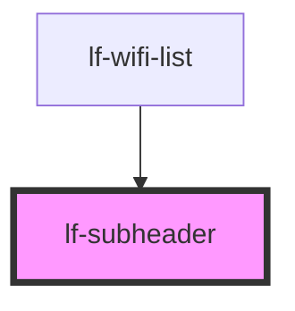

# lf-subheader


<!-- Auto Generated Below -->


## Usage

### Javascript

```html
<!-- Default -->
<lf-subheader>Subheader</lf-subheader>

<!-- Inset -->
<lf-subheader inset>Inset Subheader</lf-subheader>

<!-- List Implementation -->
<lf-list>
    <lf-subheader>List Subheader</lf-subheader>
    <lf-list-item>Item 1</lf-list-item>
    <lf-list-item>Item 2</lf-list-item>
    <lf-list-item>Item 3</lf-list-item>
</lf-list>
```

### Subheader Style API

```css
lf-subheader {
  --background: blue;
  --color: #ffffff;

  --inset: 3rem;

  --min-height: 3rem;
  --max-height: initial;

  --padding-top: 0;
  --padding-bottom: 0;
  --padding-right: 1rem;
  --padding-left: 0;

  --outer-padding-top: 0rem;
  --outer-padding-bottom: 0rem;
  --outer-padding-right: 0rem;
  --outer-padding-left: 0rem;
}
```


## Properties

| Property | Attribute | Description                                                   | Type      | Default |
| -------- | --------- | ------------------------------------------------------------- | --------- | ------- |
| `inset`  | `inset`   | If `true`,the subheader content is inset from the left border | `boolean` | `false` |


## Slots

| Slot | Description                                         |
| ---- | --------------------------------------------------- |
|      | Content is placed inside the native element wrapper |


## Shadow Parts

| Part       | Description                                                |
| ---------- | ---------------------------------------------------------- |
| `"native"` | The native HTML div element that wraps all child elements. |


## CSS Custom Properties

| Name                     | Description                           |
| ------------------------ | ------------------------------------- |
| `--background`           | Background of the subheader           |
| `--border-color`         | Color of the subheader border         |
| `--border-radius`        | Radius of the subheader border        |
| `--border-style`         | Style of the subheader border         |
| `--border-width`         | Width of the subheader border         |
| `--color`                | Color of the subheader                |
| `--inset`                | Amount to inset the subheader content |
| `--max-height`           | Maximum height of the subheader       |
| `--min-height`           | Minimum height of the subheader       |
| `--outer-padding-bottom` | Bottom padding of the item outer      |
| `--outer-padding-left`   | Left padding of the item outer        |
| `--outer-padding-right`  | Right padding of the item outer       |
| `--outer-padding-top`    | Top padding of the item outer         |
| `--padding-bottom`       | Bottom padding of the subheader       |
| `--padding-left`         | Left padding of the subheader         |
| `--padding-right`        | Right padding of the subheader        |
| `--padding-top`          | Top padding of the subheader          |


## Dependencies

### Used by

 - [lf-wifi-list](../lf-wifi-list)

### Graph


----------------------------------------------

*Built with [StencilJS](https://stenciljs.com/)*
