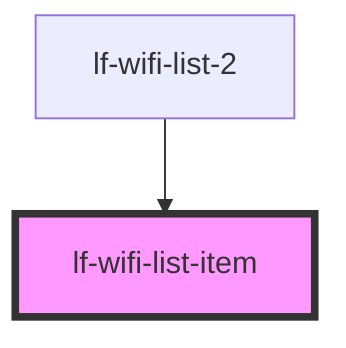

# lf-wifi-list-item

<!-- Auto Generated Below -->

## Properties

| Property                         | Attribute            | Description | Type                                                                | Default     |
| -------------------------------- | -------------------- | ----------- | ------------------------------------------------------------------- | ----------- |
| `index`                          | `index`              |             | `number`                                                            | `undefined` |
| `networkName` _(required)_       | `network-name`       |             | `string`                                                            | `undefined` |
| `passwordProtected` _(required)_ | `password-protected` |             | `boolean`                                                           | `undefined` |
| `signalStrength` _(required)_    | `signal-strength`    |             | `SignalStrength.OK \| SignalStrength.Strong \| SignalStrength.Weak` | `undefined` |

## Dependencies

### Used by

 - [lf-wifi-list-2](.)

### Graph

----------------------------------------------

*Built with [StencilJS](https://stenciljs.com/)*
